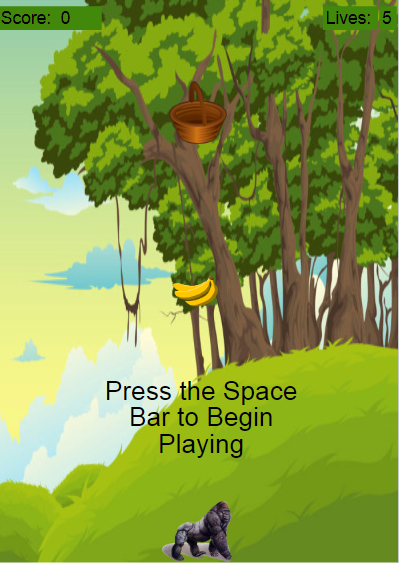

# Banana Toss Up
 A simple game designed in JavaScript using AppLab.
 
 by Lee Costich, 2018
 

 
 The purpose of this program is to be a simple game for people to play. To play the game, you must use the left and right arrow keys to move a gorilla at the bottom of the screen left or right, in order to block a moving banana from hitting the bottom of the screen. If it hits the bottom, the user will lose a life, losing the game after the loss of the last life. If the banana hits the basket, the user gains a point, and the speed of the banana increases. This [video](bananatossup_demo.mp4) illustrates myself playing the game and scoring points, displaying how the objects move on the screen. I then intentionally let the banana hit the bottom of the screen a few times, losing the game.
 
# Development
 I built my program by iterating on the basic idea of a bounce game, where the goal is to bounce a ball off of a paddle for as long as possible. I initially knew that I wanted the game to be easy to play with only one user, but I did not want to program an AI to play against. I began development by figuring out how to make the objects move on the screen, or simple animation. After distributing and testing an early version of the game, several peers mentioned that there really was no progression through the game. Therefore, I added the scoring system using the basket as a goal of sorts. Hitting the basket would score points. However, I quickly saw that it was too easy to score points, as the game could essentially go on forever with a slow pace. It was at this point that I saw the opportunity to increase the speed of the banana (or the ‘ball’) every time the basket was hit, so as to increase the difficulty. As a final development, I wanted to game to be replayable, so I developed functions to start and reset the game when the respective buttons were pressed.
 
 This program was built using the Code.org AppLab: [https://code.org/educate/applab](https://code.org/educate/applab)
 
 The AppLab is great resource for both beginning and more advanced students who want to develop smaller projects with the help of the design tools within the AppLab. 
 
# So, What's In Here?
 Within this repository, you will find the exported JavaScript file, as well as the other files necessary to run Banana Toss Up within the AppLab. A full explanation can be found at [README.txt](Banana%20Toss%20Up/README.txt), the automatically-created AppLab documentation.
 
 To see the game in action and play it within your own browser, you can click [here](https://studio.code.org/projects/applab/NXbsF2gyRSbJWUAJAWE34mYBa0McNRx_pbQ2xe6MYYQ) to play the game within the AppLab.
